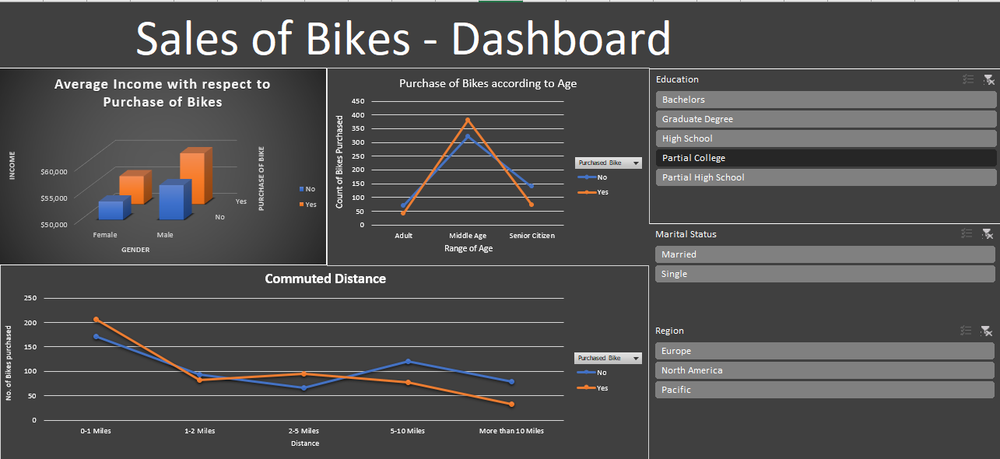

# Bike Sales Analysis - Excel Dashboard

An interactive Excel dashboard analyzing bike purchase behavior across customer
demographics including income, age, commute distance, education, marital status,
and region. Built with pivot charts and slicers for dynamic filtering.

---

## Dashboard Preview

---

## Key Insights

- Middle-aged customers show the highest bike purchase rate across all age groups
- Customers with higher average income are more likely to purchase bikes
- Bike purchases drop significantly beyond 5-mile commute distances
- North America and Europe account for the majority of purchases

---

## Dashboard Components

**Average Income by Gender and Purchase (Clustered Column Chart)**
Compares average income of buyers vs non-buyers split by gender,
revealing the income threshold associated with purchasing decisions.

**Purchase by Age Group (Line Chart)**
Tracks bike purchase counts across Adult, Middle Age, and Senior Citizen
segments for both buyers and non-buyers.

**Commute Distance vs Purchase (Line Chart)**
Shows how purchase likelihood decreases as commute distance increases,
with the sharpest drop beyond 5 miles.

**Slicers**
Dynamic filtering by Education, Marital Status, and Region --
all charts update in real time based on selections.

---

## Files

| File | Description |
|---|---|
| `Excel Project Dataset.xlsx` | Raw dataset with customer and sales data |
| `Sales of Bikes - Dashboard.xlsx` | Interactive Excel dashboard |
| `dashboard.png` | Dashboard screenshot |

---

## How to Open

1. Download `Sales of Bikes - Dashboard.xlsx`
2. Open in Microsoft Excel (2016 or later recommended)
3. Use the slicers on the right to filter by Education, Marital Status, or Region
4. All charts update automatically based on your selections

---

## Tools

`Microsoft Excel` `Pivot Tables` `Pivot Charts` `Slicers`

---

## Author

Pavithra Lakshmi Venugopal
M.Sc. Data Science Student, Hochschule Fulda
